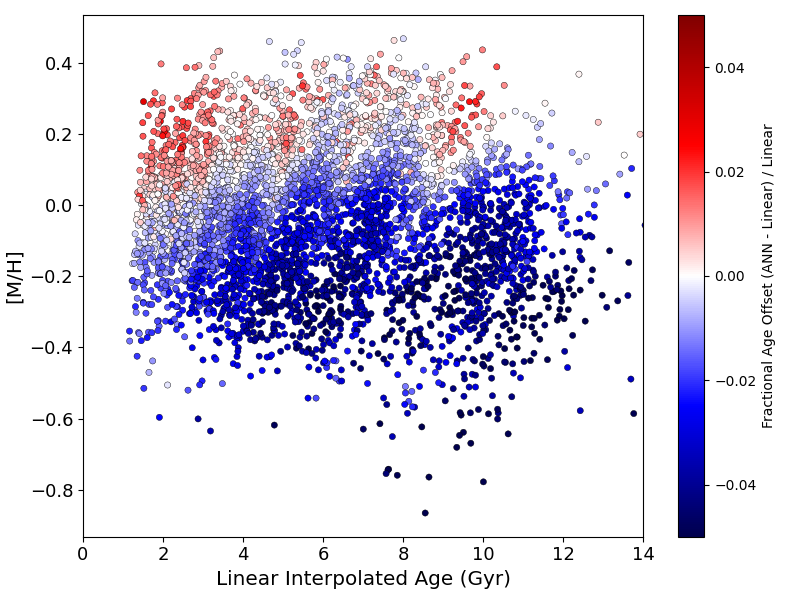
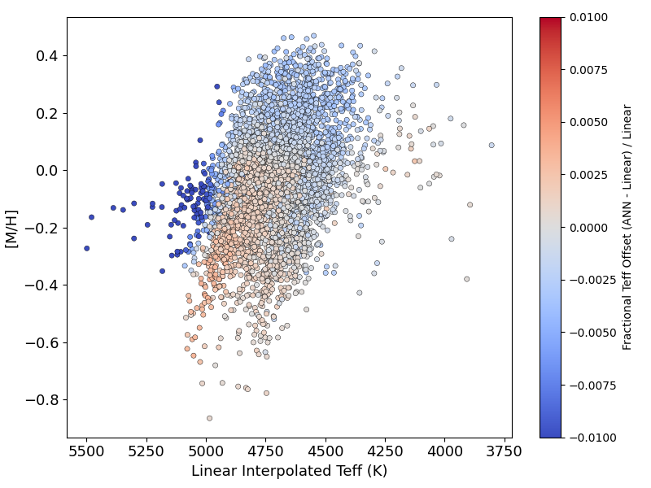
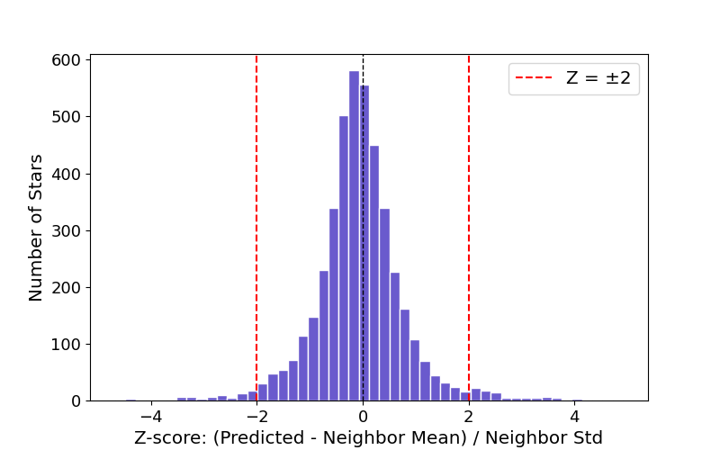

# Stellar Evolution Emulator Using Artificial Neural Networks

This project explores the use of artificial neural networks (ANNs) to emulate stellar evolutionary tracks from YREC models, with a focus on the Red Giant Branch (RGB). The study assesses the performance of the ANN in predicting stellar age and effective temperature from input parameters such as mass, metallicity, and surface gravity. The goal is to evaluate whether this machine learning approach can serve as a fast and flexible alternative to traditional interpolation methods. Initial training and testing were performed using GPU acceleration to enable efficient experimentation.

## Project Structure

```bash
├── data/  # Input files:
│   ├── yrec_eep.pqt          # Training/Validation/Test set: mass, metallicity, logg, age, Teff
│   ├── yrec_linearinterp.csv # Validation set for model performance against traditional linear interpolation from Kīauhōkū
│   ├── APOKASC3.csv   # Sample of stars used in validation
├── figures/ # Output plots and visualizations
├── ANN.ipynb # Notebook for building, training, and evaluating the ANN
└── README.md # This file
```

## Dependencies 

This project requires the following Python packages:

- tensorflow==2.18.0 *(For GPU compatibility)*
- numpy
- pandas
- scikit-learn
- matplotlib
- jupyter *(Optional, for running the notebook interactively)*

## Installation & Setup

To get started, clone the repository:

```bash
git clone https://github.com/lmariemorales/ann-emulator-stellarages.git
cd ann-emulator-stellarages
```

Then install the required dependencies:

```bash
pip install tensorflow==2.18.0 numpy pandas scikit-learn matplotlib jupyter
```

## Results

### Age Offset



Mean fractional offset: -0.0169 ± 0.0175

We show age as a function of metallicity colorized by fractional offset between ANN predicted age and the linearly interpolated age. This is a promising result! The linear interpolation used in the traditional method tends to bias ages toward the lower-mass track, which corresponds to older ages, due to how interpolation weights are assigned. The fact that the ANN is predicting slightly younger ages suggests that it’s more accurately mapping out the non-linear relationship between stellar parameters and age. In other words, it's correcting for the traditional method's tendency to overestimate age in certain regions of the grid.


### Temperature Offset



Mean fractional Teff offset: -0.0005 ± 0.0029

We show effective temperature as a function of metallicty, colorized by the fractional offset between ANN predicted temperature and linearly interpolated temperature. This is also a good indication! A small offset here is expected since temperature tends to have a more linear relationship with the input stellar parameters. It suggests that the ANN is capturing the expected trends.

### Z-Score Consistency Plot



This plot shows the local Z-score for each prediction, calculated using K-Nearest Neighbors. A small neighborhood size (K = 5) was used to avoid capturing stars from different evolutionary paths, since the Red Giant Branch is very narrow. Most predictions fall within $1\sigma$ of their local neighborhood, indicating consistent and stable ANN performance across the grid.

### Local Consistency: Edge vs. Interior Stars

To assess how well the ANN handles predictions at the edges of the parameter space, we compared Z-scores for stars near the grid boundaries (“edge cases”) and those in denser interior regions.

| Group          | Mean Z-Score |
|----------------|--------------|
| Edge Cases     | 0.97         |
| Interior Stars | 0.65         |

Z-scores for both cases remain below 1, indicating that predictions generally agree with their local neighborhood. The slightly higher Z-score for edge cases is expected, as those regions are less well-constrained by training data. This result confirms the ANN maintains local consistency across the grid.

## References

This project builds on several key resources:

- **YREC Model Grid** – The stellar model grid used for training was published as part of Tayar et al. (2022), and is based on tracks computed using the Yale Rotating Evolution Code (YREC).  
  Tayar, J., Claytor, Z. R., Huber, D., & van Saders, J. (2022).  
  *A Guide to Realistic Uncertainties on the Fundamental Properties of Solar-type Exoplanet Host Stars*.  
  The Astrophysical Journal, 927(1), 31.  
  [ADS link](https://ui.adsabs.harvard.edu/abs/2022ApJ...927...31T)


- [**Kīauhōkū**](https://github.com/zclaytor/kiauhoku) – A Python package used to generate traditional interpolation results for comparison with the ANN predictions.

  Claytor, Z. R., van Saders, J. L., Santos, Â. R. G., García, R. A., Mathur, S., Tayar, J., Pinsonneault, M. H., & Shetrone, M. (2020).  
  *Chemical Evolution in the Milky Way: Rotation-based Ages for APOGEE-Kepler Cool Dwarf Stars*.  
  The Astrophysical Journal, 888(1), 43.  
  [ADS link](https://ui.adsabs.harvard.edu/abs/2020ApJ...888...43C)


- **Neural Network Architecture** – The ANN structure and training approach were adopted from:  
  
  Saunders, N., van Saders, J. L., Lyttle, A. J., Metcalfe, T. S., Li, T., Davies, G. R., Hall, O. J., Ball, W. H., Townsend, R., Creevey, O., & Dodds, C. (2024).  
  *Stellar Cruise Control: Weakened Magnetic Braking Leads to Sustained Rapid Rotation of Old Stars*. 
  The Astrophysical Journal, 962(2), 138. 
  [ADS link](https://doi.org/10.3847/1538-4357/ad1516)

- **Machine Learning Framework** – Model training and evaluation were implemented using [TensorFlow](https://www.tensorflow.org/).  

> Please cite original sources when reusing these models or methods.
